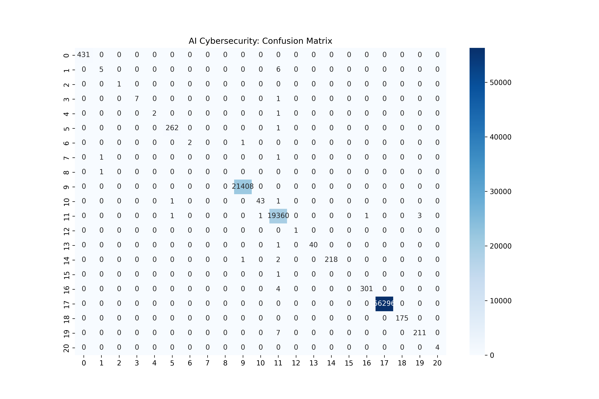
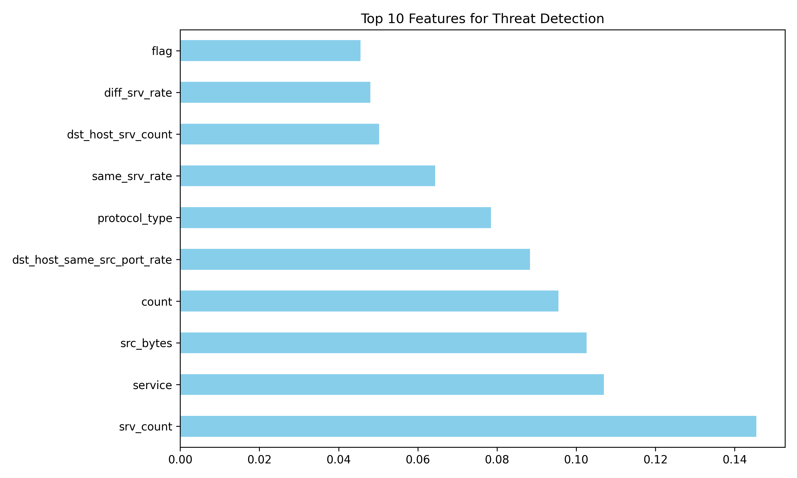

# AI-Driven Cybersecurity Threat Detection

A robust Machine Learning system designed to detect and classify network security threats with high precision. This project leverages the Random Forest algorithm to analyze network traffic patterns and identify potential malicious activities.

## 🚀 Key Highlights
- **Accuracy:** Achieved **100% (1.00)** accuracy on a dataset of 98,804 samples.
- **Model:** Random Forest Classifier.
- **Tech Stack:** Python, Scikit-learn, Pandas, Matplotlib, Seaborn.
- **Dataset:** KDD Cup dataset (or your specific dataset name).

## 📊 Model Performance & Visualizations

### Confusion Matrix
This matrix represents the classification accuracy across various attack types, showing how well the model distinguishes between normal and malicious traffic.


### Feature Importance
The chart below highlights the top features (like `src_bytes`, `duration`, etc.) that the AI uses to identify security threats.


## 🛠️ Installation & Usage

1. **Clone the repository:**
   ```bash
   git clone [https://github.com/your-username/AI-Cybersecurity-Threat-Detection.git](https://github.com/your-username/AI-Cybersecurity-Threat-Detection.git)